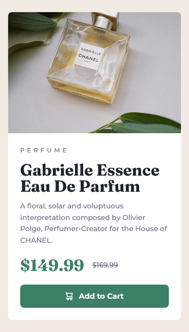

# Frontend Mentor - Product preview card component solution

This is a solution to the [Product preview card component challenge on Frontend Mentor](https://www.frontendmentor.io/challenges/product-preview-card-component-GO7UmttRfa). Frontend Mentor challenges help you improve your coding skills by building realistic projects. 

## Table of contents

- [Overview](#overview)
  - [The challenge](#the-challenge)
  - [Screenshots](#screenshots)
  - [Links](#links)
- [My process](#my-process)
  - [Built with](#built-with)
  - [What I learned](#what-i-learned)
  - [Continued development](#continued-development)
- [Author](#author)
- [Acknowledgments](#acknowledgments)

## Overview

### The challenge

Users should be able to:

- View the optimal layout depending on their device's screen size
- See hover and focus states for interactive elements

### Screenshots

#### Mobile version

#### Desktop version

### Links

- [Solution](https://www.frontendmentor.io/solutions/responsive-product-preview-card-component-using-css-grid-bHW0957dMW)
- [Live version](https://ubiquitous-gelato-f0cae9.netlify.app/)

## My process

### Built with

- Semantic HTML5 markup
- CSS custom properties
- Flexbox
- CSS Grid
- Mobile-first workflow

### What I learned

I made this project by following Kevin Powell's tutorial. Making it I learned:

- How to approach a project thinking mobile-first
- BEM methodology for CSS
- CSS reset
- How to use CSS custom properties for setting colors, typography
- Utility classes
- CSS Grid and Flexbox
- How and when to use relative units like **em** and **rem**
- How to improve application readability
- Add extra context for accessibility reasons

### Continued development

More about how to create layouts using Flexbox and Grid. Responsiveness, media queries, how to organize the code to make it clean, reusable and maintainable are also some of my aims.

## Author

Mateus Destefani Fabri  
  

## Acknowledgments

My solution was built based on [Kevin Powell's](https://www.youtube.com/@KevinPowell) tutorial. His detailed and clear explanation helped and taught me a lot.
